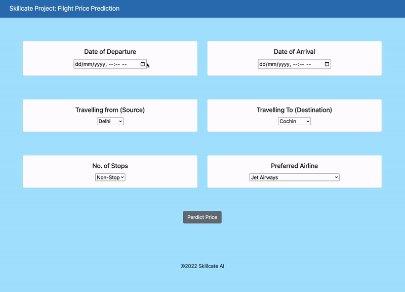

# ✈️ FareX - Flight Fare Prediction App  

**FareX** is a Python-based application designed to predict flight fares based on user-input travel details. This project leverages machine learning and data visualization to assist users in determining fare trends and making informed booking decisions.

---

## App Functionality


---

## 🚀 Project Overview  

Flight fare prediction is a classical time-series problem that identifies trends in past observations to forecast future prices. Popular tools like Google Flights provide insights into:  
- **Fare status**: Whether fares are high, low, or average.  
- **Past and future fare trends.**  
- **Ideal booking times for flights.**  

This app predicts flight prices based on:  
- Departure and arrival dates.  
- Source and destination cities.  
- Stoppages.  
- Airline carriers.  

---

## 🎯 Features  

- **Fare Prediction**: Utilizes machine learning models like Random Forest, Decision Trees, and XGBoost.  
- **Data Visualization**: Graphical representation of price trends for better decision-making.  
- **User-friendly Interface**: Flask-powered application for a seamless user experience.  
- **Model Evaluation**: Accuracy assessed through metrics like MAE, MSE, and R².

---

## 🛠️ How to Set Up  

### Prerequisites  
Ensure the following are installed:  
- [Python 3.9+](https://www.python.org/downloads/)  
- [Git](https://git-scm.com/downloads)  

---

### Steps to Run on Windows  

1. Clone the repository:  
   ```bash  
   git clone https://github.com/Aadhityan-Senthil/FareX.git  
   ```  
2. Navigate to the project folder:  
   ```bash  
   cd FareX  
   ```  
3. Create and activate a virtual environment:  
   ```bash  
   pip install virtualenv  
   virtualenv ENV  
   .\ENV\Scripts\activate  
   ```  
4. Install dependencies:  
   ```bash  
   pip install -r requirements.txt  
   ```  
5. Run the app:  
   ```bash  
   python app.py  
   ```  
6. Deactivate the virtual environment after usage:  
   ```bash  
   deactivate  
   ```

---

### Steps to Run on Mac/Linux  

1. Clone the repository:  
   ```bash  
   git clone https://github.com/Aadhityan-Senthil/FareX.git  
   ```  
2. Navigate to the project folder:  
   ```bash  
   cd FareX  
   ```  
3. Create and activate a virtual environment:  
   ```bash  
   pip install virtualenv  
   virtualenv ENV  
   source ENV/bin/activate  
   ```  
4. Install dependencies:  
   ```bash  
   pip install -r requirements.txt  
   ```  
5. Run the app:  
   ```bash  
   python app.py  
   ```  
6. Deactivate the virtual environment after usage:  
   ```bash  
   deactivate  
   ```

---

## 📂 Project Structure  

```plaintext  
FareX/  
├── static/             # Static assets (CSS, images)  
├── templates/          # HTML templates  
├── Flight.py           # Main flight price prediction script  
├── Graph.py            # Visualization script  
├── requirements.txt    # Python dependencies  
├── README.md           # Project documentation  
├── LICENSE             # License information  
├── Datasets:  
│   ├── a1_FlightFare_Dataset.xlsx  
│   ├── a2_Unseen_Dataset.xlsx  
│   ├── c2_ModelOutput.xlsx  
└── b1_fare_prediction_model.ipynb  # Model training notebook  
```  

---

## 📊 Dataset  

- Primary Dataset: [Kaggle - Flight Fare Prediction Dataset](https://www.kaggle.com/datasets/nikhilmittal/flight-fare-prediction-mh).  
- Includes features like fare price, airline, departure/arrival times, and stoppages.

---

## 🔧 Bug Reports & Feature Requests  

Found a bug or have an idea for improvement? Create an issue [here](https://github.com/Aadhityan-Senthil/FareX/issues) and let us know!

---

## 📜 License  

This project is licensed under the [CC0 1.0 Universal (Public Domain Dedication)](LICENSE).

---

## 🔗 Important Links  

- [Dataset](https://www.kaggle.com/datasets/nikhilmittal/flight-fare-prediction-mh)  
- [Google Drive (Project Files)](https://drive.google.com/drive/folders/1vnapi048bbmoXyoxOLLX6W_tA6a1uQ9w?usp=sharing)
